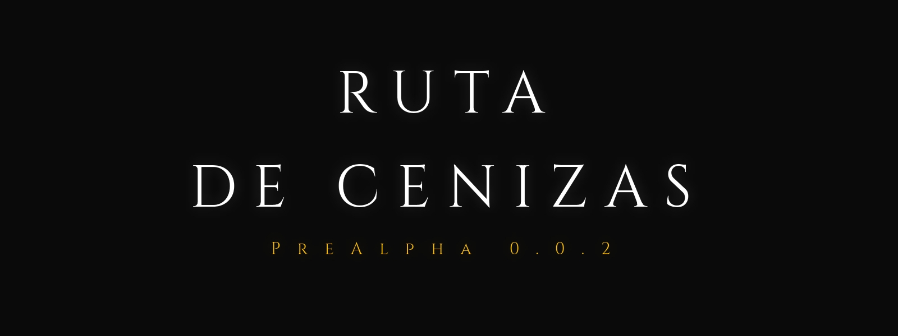
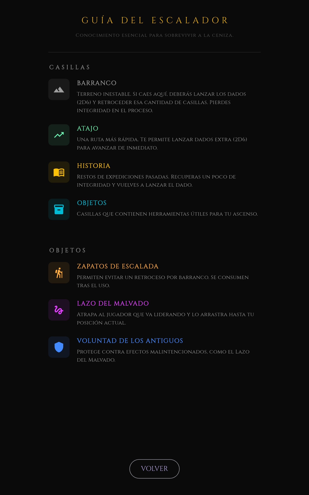
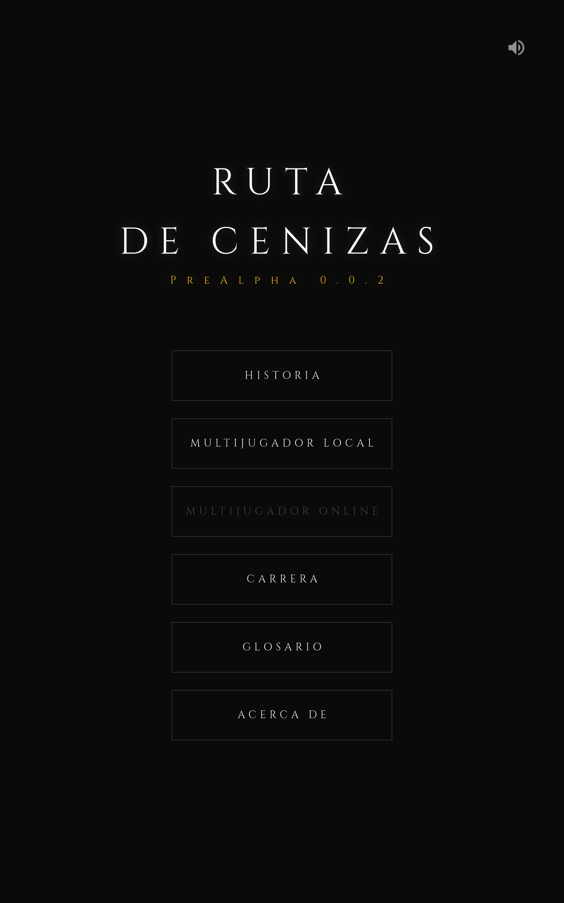
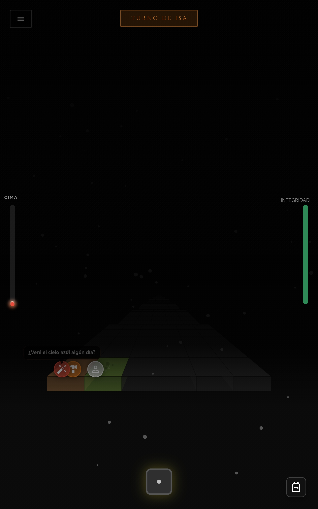
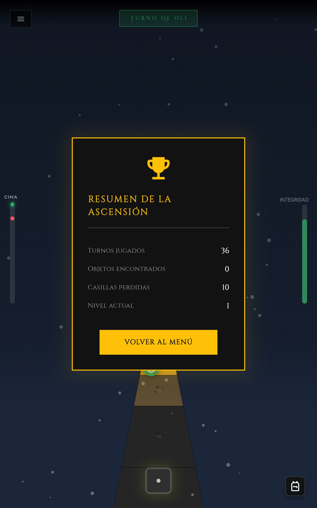

# 🌋 Ruta de Cenizas

> "No mires hacia abajo. La luz está ahí, a solo unos pasos. No te detengas."

**Ruta de Cenizas** es una experiencia minimalista de supervivencia y ascenso procedural. En un mundo cubierto por el olvido y el polvo volcánico, tu único objetivo es alcanzar la cima, donde el aire aún es respirable y el cielo recupera su color.

---

## 🌫️ El Viaje

En este juego, cada paso es una decisión entre la esperanza y el abismo. Utilizando una perspectiva forzada y un tablero generado proceduralmente, **Ruta de Cenizas** te sumerge en una atmósfera opresiva donde la soledad es tu única compañera, o tu mayor rival.

### Características Principales
- **Ascenso Infinito (Procedural)**: Cada partida genera un camino único hacia la cumbre. Nunca escalarás la misma montaña dos veces.
- **Perspectiva Forzada**: Un motor visual personalizado que simula profundidad y altura, reforzando la sensación de vértigo.
- **Atmósfera Dinámica**: Desde la oscuridad absoluta de la base hasta la luz cegadora de la cima, con efectos de partículas de ceniza y neblina que reaccionan a tu progreso.
- **Narrativa Fragmentada**: Encuentra los diarios de quienes lo intentaron antes que tú y descubre la historia oculta tras la ceniza.

---

## 🎲 Mecánicas de Juego

### El Ascenso
El movimiento se rige por el azar. Lanza los dados para avanzar, pero ten cuidado: la montaña es traicionera.

- **Integridad (HP)**: Tu resistencia física. Caer por barrancos te hará retroceder y perder integridad. Si llega a cero, el frío te reclamará.
- **Gestión de Turnos**: En el modo multijugador, la competencia es feroz. ¿Ayudarás a otros? Yo digo que no.

### Los Peligros y la Suerte (Tipos de Casilla)
| Casilla | Efecto |
| :--- | :--- |
| **Normal** | Un respiro en la escalada. |
| **Barranco** | ¡Cuidado! Debes lanzar 2D6 para determinar cuánto retrocedes y cuánta integridad pierdes. |
| **Atajo** | Un golpe de suerte. Lanza 2D6 para impulsarte hacia arriba. |
| **Historia** | Encuentra un fragmento de diario. Recuperas integridad y obtienes un turno extra. |
| **Consumible** | Encuentra objetos útiles perdidos por expediciones pasadas. |

---

## 🎒 Equipo de Supervivencia

No estás totalmente indefenso. Durante tu viaje podrás encontrar objetos clave:

- **👞 Zapato de Escalada**: Te permite evitar una caída fatal en un barranco. (Solo uno, ¡esperamos que sea el del pie correcto!).
- **🪢 Lazo del Malvado**: Un objeto de dudosa moralidad. Permite atrapar al líder y arrastrarlo hasta tu posición.
- **✨ Voluntad de los Antiguos**: Un amuleto cargado de magia antigua que te protege de los ataques malintencionados de otros escaladores.

---

## 🏔️ Modos de Juego

*El menú principal.*

### 📖 Modo Historia (Solo)
Enfréntate a la montaña y a los fantasmas del pasado (Bots). Tu objetivo es llegar a la cima mientras desbloqueas los 10 fragmentos de la historia que narran el destino de este mundo.

### 👥 Multijugador Local
Compite con hasta 4 amigos en el mismo dispositivo. La montaña es pequeña para tantos, y solo uno puede coronar la cima. ¿Serás un escalador honorable o usarás el *Lazo del Malvado* para asegurar tu victoria?

### 👥 Multijugador Online
Lucha hasta con 4 jugadores por llegar a la cima. EN DESARROLLO.

---

## 🖼️ Galería

*El inicio del ascenso bajo la neblina de ceniza.*

*En lacima, donde la luz del sol finalmente atraviesa el manto negro.*

---

## 🛠️ Tecnologías

Este proyecto explora las capacidades de **Flutter** para el desarrollo de juegos indie, utilizando:
- **Flame Engine**: Para el ciclo de juego y renderizado.
- **Custom Shaders & Particles**: Para los efectos de ceniza y atmósfera.
- **Procedural Generation Algorithms**: Para la creación del tablero.

---

## 📥 Instalación y Descarga

Para jugar la versión más reciente en tu dispositivo Android, visita la sección de lanzamientos:

👉 **[Descargar última versión (APK)](https://github.com/Isamorap/ruta_de_cenizas/releases)**
👉 **[Link directo, pero te pierdes la lectura :'C (APK)](https://github.com/Isamorap/ruta_de_cenizas/releases/download/Ruta_de_Cenizas_0.0.6/Ruta_de_Cenizas_v0.0.6.apk)**

---

Desarrollado con pasión por Isaac Mora. 
*La ceniza lo borra todo, menos la voluntad de subir.*
